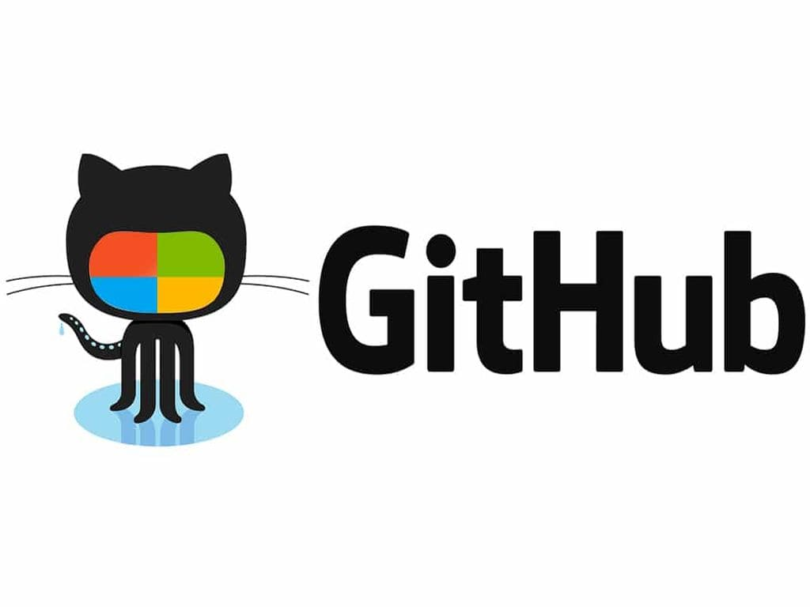

# **Работа с Git и GitHub**

## ✅**1. Проверка наличия установленного Git**

В терминале выполнить команду `git --version`.

Если Git установлен появится сообщение с инф-цией о версии программы, иначе будет сообщение об ошибке.

## ✅**2. Установка Git**

Загружаем последнюю версию Git с сайта https://git-scm.com/downloads.
Устанавливаем с настройками по умолчанию.

## ✅**3. Настройка Git**

При первом использовании программы необходимо представиться.
Для этого нужно ввести в терминале (открыть терминал можно с помощью клавиш CTRL+ `) две команды:
```
git config --global user.name «Ваше имя»
git config --global user.email ваша "почта@example.com"
```
где в кавычках вводим наше имя (для 1-й команды) и нашу электронную почту (для 2-й команды).

## ✅**4. Работа с репозиторием**

Для работы с репозиторием вызываем Терминал с помощью сочетания клавиш CTRL+`

**4.1. Инициализация репозитория**

Чтобы создать репозиторий, для начала необходимо создать папку в которой мы будем работать, далее, чтобы из папки создать репозиторий вводим команду `git init` - инициализация репозитория.

**4.2. Сохранение (запись) изменений**

Для сохранения изменений в папке сперва необходимо добавить файл к коммиту с помощью команды `git add`. Далее через пробел вводим первые 3 символа названия файла и нажимаем клавишу TAB, чтобы выбрать нашу папку/файл. Далее нажимаем клавишу ENTER

После создания записи для коммита необходимо записать сам коммит (❗). Для этого вводит команду `it commit -m "сообщение/комментарий изменений"` (❗❗).

(❗)Внимание: для того чтобы сохранить изменения, обязательно вводить команды в следующем поряде: 
```
1. git add
2. it commit -m "сообщение/комментарий изменений"
```
Т.е сперва добавляем файл к коммиту и только потом записываем коммит, в противном случае изменения записаны не будут.

(!!) Возможно добавить файл к коммиту и записать сам коммит единой командой ` git -am "сообщение/комментарий изменений"`

**4.3 Просмотр версий и изменений**

4.3.1. Для просмотра хэш-кода списка версий, а также изменений в репозитории вводим команду `git log`. Для "сокращенного" варианта истории можно ввести команду ` git log --oneline`

4.3.2. Чтобы перейти от одной версии (коммита) к другому вводим команду `git checkout` и номер хэщ-кода целиком, либо первые 4 символа.

4.3.3. Для перерохода в актуальный коммит (версию) файла вводим `git checkout master`

4.3.4. Чтобы увидеть разницу между текущим файлом и закоммиченным используем команду `git diff`

## ✅**5. Синтаксис языка Markdown**

* "#" (без кавычек) Заголовок – выделение заголовков. Количество символов “#” задаёт уровень заголовка (всего поддерживается 6 уровней).

* = или - – выделяют заголовкипервого (“=”) и второго (“-”) уровней.

* ** Полужирное начертание** или __ Полужирное начертание__

* *Курсивное начертание* или _Курсивное начертание_

* *** Полужирное курсивное начертание *** (*- без пробелов вначале и конце текста)

* ~~ Зачёркнутый текст ~~ (~ - без пробелов вначале и конце текста).

* ("звездочка*"- без пробелов вначале текста) Строка – ненумерованные списки, символ “*” в начале строки.

* 1, 2, 3 … – нумерованные списки

## ✅**6. Игнорирование файлов**

Для того, чтобы исключить из отслеживания в репозитории определённые файлы и папки, необходимо создать файл ***.gitignore***
и записать в него название или шаблоны (через * и расширение файла), соответствующие таким файлам и папкам.

## ✅**7. Создание и удаление веток в Git**

По умолчанию первая и главная ветка при создании файла git называется *master*.
Создание веток служит "черновиком" для работы, после чего, ее можно соединить с основной веткой, т.е с веткой *master*.
Создать ветку можно с помощью команд:
```
git branch название_ветки
git checkout -b название ветки (❗)

(❗) Данная команда позволяет сразу создать ветку и в нее переключиться.
```
*Git branch* - позволяет посмотреть список веток в репозитории.
Текущая ветка будет подсвечена зелёным цветом и отмечена здвездочкой: **\*master**.

*Git branch -d название_ветки* -удаляет неактуальную ветку.

*git branch -D название ветки* - принудительно удаляет несоединенную ветку.

## ✅**8. Слияние веток в Git**

После того, как работа в неосновной ветке (она же ветка-черновик) завершена и согласована. Ветку-черновик необходимо соединить с основной веткой, т.е по умолчанию с master.

Для этого выполняем пошагово следующие действия:

1. Коммитим изменения в ветке-черновике с помощью команды `git commit -am "комментарий к коммиту"`(данная команда сразу индексирует изменение и коммитит), либо вначале выполняем команду `git add название файла` затем `git commit -m "комментарий к коммиту"`.

2. После первого шага возвращаемся в основную ветку (ветку-мастер: по умолчанию ее название будет master). Для этого вводим команду git checkout master (❗)

(❗) Если вы не закоммитили изменения в ветке-черновике, и пытаетесь соединить ветку-черновик с основной, то git выдаст ошибку.

3. Вводим команду `git merge название_ветки-черновика`. (❗)

(❗) Если в основной ветке и ветке-черновике будут расхождения, то visual studio подсветит разницу и предложит принять либо входящие изменения, либо текущие. Необходимо разрешить конфликт, после чего закоммитить изменения, если этого не сделать, то git выдаст ошибку:
```
fatal: You have not concluded your merge (MERGE_HEAD exists).
Please, commit your changes before you merge.
```

4. После слияния веток, коммитим изменения в основной ветке.

5. На последнем шаге можно удалить ветку-черновик с помощью команды `git branch -d название_ветки`

## ✅**9. Работа с удалённым репозиторием**

**9.1. Создание аккаунта на сайте Github.com**

Процедура создания аккаунта на сайте не отличается от других процедур регистраций на иных сайтах: заходим на сайт, на главной странице вводим свою почту, логин, придумываем пароль и подтверждаем регистрацию.

**9.2. 
